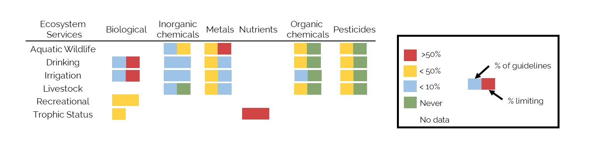
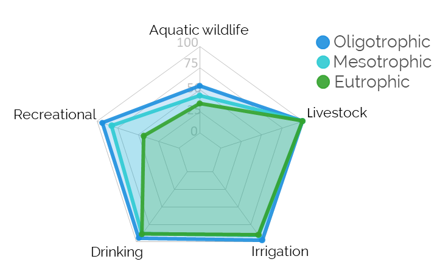
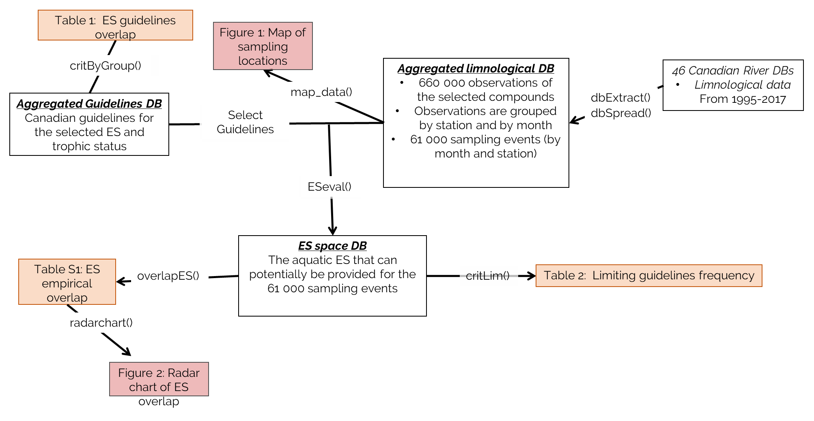

```{r global_options, include=FALSE}
knitr::opts_chunk$set(fig.width=12, fig.height=8, fig.path='figures/',
                      echo=TRUE, warning=FALSE, message=FALSE,fig.width=6, fig.height=6,fig.align = "center")

knitr::opts_knit$set(output.dir="reports")
```

#Abstract

* WQ perspective in the different fields
* How water quality is tested and how it this evaluation compare with real data.  

How would you define water quality? Even if it’s a concept that is often used to characterize the suitability body of water to provide a given ecosystem service, defining this concept is not a simple task. One of the mains challenges of defining water quality is that  the notion of it is highly context dependent. For example, an ecologist may view water quality as a function of trophic status, whereas from a public health perspective,  water quality is defined as a characteristic of a water that is safe for human consumption or recreation. As a consequence, the parameterization of water quality  is often limited to very specific criteria for different aquatic ecosystem services (ES). Water quality is rarely assessed as an integrative measure that  considers the trade offs between multiple uses. 

#Introduction

**Water is a resource at risk: quality of water is decining around the globe** 

Water is a resource that under a great pressure at a global level, in 2010 it was evaluated that "80% of the world’s population is exposed to high levels of threat to water security" [@vorosmartyGlobalThreatsHuman2010]. In Canada it was evaluated that "pollution is a concern in 60 of 167 sub-watersheds" in Canada [@wwfNationalAssessmentCanada2017]. 


**How science is approaching the water quality issue: the relative importantce of the term water quality in scientific research is increasing **

The relative importance of the term water quality in the ecological litterature and in the scientific literature in general have steadily increased over the last 40 years (Figure 1 b). According to [dimensions.ai](https://www.dimensions.ai/)), the proportion of published papers in ecology with the term water quality has more than doubled (from 6.6% to 14% of papers) since 1980, and the occurrence within the abstract or title of ecological papers has more than tripled over the same period (from 0.7% to 2.3%). The increase use of the term water quality in ecology, is similar to what was observed in other fields (Figure 1b).

Water quality is a complex concept by definition as it “express the suitability of water to sustain various uses or processes". 

Hence, we wanted also to assess as the term water quality increase in importance, to which components of water quality this increase can be attributed to and how the reltive importance of components vary between fields. 


**How the perception of water quality vary between different fields** 

In ecology, changes in water quality are often equated to the eutrophication of aquatic ecosystems,  [see,  @smithEutrophicationFreshwaterCoastal2003; @howarthNitrogenLimitingNutrient2006]. When water quality was present in abstract or title of an ecological papers, in 2017 42% of the time a term related to eutrophication was also found in the abstract (i.e. eutrophication, nutrient, phosphorus, nitrogen, nitrate) a proportion that stayed stable since 2000. While the use of the term biodiversity along water quality have trippled in ecological abstracts. 

In contrast, in public health research, the term water quality was 41% of the time found along a term related to drinking  (keyword: drink*), compared to ecology where this proportion is only 3%. 

 


{size=200%}


```{r data,echo=F}


library(scales)
library(segmented)
source("R/dimensions.R")
#plot.trends()
ReporteRsWrap(plot.trends,"trends")
```
*Figure 1: (a) comparing three different world views of water quality and (b) The temporal evolution (1980-2017) of the  proportion of paper with the term water quality in different fields and in the literature in general based on [dimensions.ai](https://www.dimensions.ai/)*. 


**Water quality is multidimentional by definition =  different world views**
This example, demonstrate that there is different world views of water quality, world views that have focus on different services and metrics (see Figure 1).

**The need to understand how these world views move toghether**
* Moving forward there is a need to look at these different world views toghether and understand how the move toghether to help and to define a safe operating space of water quality that encompass all these world views
* Can ecology reconcile these world views? 

**The water quality index approach**

The goal of water quality indices (WQI) is " to give a single value to water quality of a source alongwith reducing higher number of parameters into a simple expression resulting into easy interpretation of water quality monitoring data" [@tyagi2013water]. But the quest toward the universal WQI is still ongoing and will likely never be resolved: "no index has so far been universally accepted and search for more useful and universal water quality index is still going on, so that water agencies, users and water managers in different countries may use and adopted it with little modifications."
We ask the question if there is better ways to conceptualize water quality 


```{r init data,echo=F}

#Import the canadian rivers dataset data on stations and the canadian guidelines

library(knitr)
library(kableExtra)
library(ReporteRs)
library(maps)
library(fmsb)
library(dplyr)
library(ggplot2)
library(tidyr)
#library(png) 

source("R/functions.R")
source("R/critByGroup.R")
source("R/overlapES.R")

load("data/dataCDNe.coli.RData")
load("data/sitesClasse.coli.RData")
load("data/critLime.coli.RData")
colFreq<-function(x)sum(!is.na(x))/length(x)
input =read.csv("inputs/dbInput_cdnRiv.csv",na.strings = "",stringsAsFactors = T)


```


# Approach and framework

The main objective with the framework we are developing here is to enable an evaluation of how often ES [...]

**Aggregated guideline database**

We created an aggregated guidelines database (*link to the Db*) composed of Canadian guidelines that are used to determine if water can safely provide the following selected uses: drinking water, recreation (i.e. swimming), irrigation, livestock water and for the protection of aquatic wildlife (CCME REF). *Few guidelines were under the detection limit for a compounds, in those situations we used detection limit multiplied by 2 as a guideline to [...]*. For trophic status, we used @dodds_suggested_1998  river trophic status classification. In summary, the Canadian guidelines for the five selected uses are based on  `r length(unique(guide$Pollutant))` different chemical compounds. We then grouped the guidelines by chemical groups (based on the CCME classification) to assess the amount of overlap between the guidelines used for each ecosystem service. To do so, for each ES, we calculated the proportion of guidelines used in each chemical group (See Table 1). Following this step, for each chemical group we selected compounds that we used as guidelines for the highest number of ES for further analyses (see categories table). 

*Table 1: The proportion of guidelines in each chemical group by ecosystem services (ES) based on Canadian guidelines [@ccmeCanadianEnvironmentalQuality2018;@doddsNitrogenPhosphorusEutrophication2016].*


**Creating an aggregated limnological database**

We developed a R function (*dbExtract*) to search openly available Canadian limnological databases for measures of the previously selected compounds (see Table X) in rivers. The search within databases 46 databases resulted in 660 000 unique observations in river across Canada (See Figure 1) between over 22 years 1995-2017. Observation, were then grouped by station and by month (*dbSpread* function) to create a aggregated limnological database of `r nrow(db_wide_ym)` observations. 

```{r map ,echo=F,fig.width=7,fig.height=5,fig.cap="\\label{fig:map}Figure 1 : Map of sampling locations across canada"}

#plotMap<- function(){
world_map <- map_data("world", "Canada") 

#Creat a base plot with gpplot2
p <- ggplot() + coord_fixed() +
  xlab("") + ylab("")

cleanup <- 
  theme(panel.grid.major = element_blank(), panel.grid.minor = element_blank(), 
        panel.background = element_rect(fill = "transparent",colour = NA),
        plot.background = element_rect(fill = "transparent",colour = NA),
        axis.line = element_line(colour = "white"), legend.position="none",
        axis.ticks=element_blank(), axis.text.x=element_blank(),
        axis.text.y=element_blank())

points<-
  geom_point(data=location, 
             aes(x=long, y=lat), colour="black", 
             fill="black",pch=21, size=1, alpha=I(0.6))

#Add map to base plot
base_world <- p + geom_polygon(data=world_map, aes(x=long, y=lat, group=group), 
                                     colour="light blue", fill="light blue")+ cleanup  +points
base_world

#}

plotMap<-function(){print(base_world)}

  #ppi=600
  #png("figures/mapCdn.png",width = 4, height = 5, units = 'in',bg="transparent",res=ppi)
  #print(base_world)
  #dev.off()

  #ReporteRsWrap(plotMap,"mapCDN")


```


We also developed the *ESeval* function to evaluate, for each sampling event (by month and by station) in the aggregated limnological DB, the potential of providing each ES based on the aggregated guideline db (See Figure S1). Because there was an important variability in the variables measured at each sampling event,  the potential of providing a given ES was based on the guidelines for which a measure was available.  When for a sampling event no measures enable to evaluate whether a service could be provided, the service wasn't evaluated for this specific event. To compare the overlap in guidelines (Figure 1) to the empirical overlap between uses in river, we developed the *overlapES()*  function to calculate how often when one five services can be provided, other services can be provided as well.

*Identify which guidelines is limiting use across sites*

Finally for, for each selected guidelines, we calculated how often it was limiting a specific use. We developed the *limFreq()* function, which simply calculates how often a a specific compound was over the guideline, hence preventing a ES form being provided, when measured. The results from this analysis are reported in table S1, and for each chemical groups we report the highest limiting frequency in table X. This metric enable to (i) compare the how often a guideline is used versus how often it is empirically limiting and (ii) identify compounds that are often limiting but rarely measured which could mean that we overestimated of often a given use can be provided by a system. 
```{r Explore guidelines ,echo=F,include=F}

# explore the frequency of each guideline
polFreq=matrix(NA,length(unique(guide$Pollutant)),2,dimnames=list(unique(guide$Pollutant),c("Group","Freq")))

i="fc"
#for(i in rownames(polFreq)){
#  polFreq[i,"Freq"]=length(unique(guide[guide$Pollutant%in%i,"SuperCategory"]))
#  polFreq[i,"Group"]=unique(guide[guide$Pollutant%in%i,"Chemical.groups"])
#}


# This function calculates the proportion of guidelines by chemical groups for each ES. Output is a table 
polCat=critByGroup(guide$Chemical.groups,guide$SuperCategory)

# modify the table to only output the desired ES and chemical groups. 
remove.cols=c("Disinfectant & BP","Physical","pH","DOC")
remove.rows=c("DOC")
polCat.mod=round(polCat[ !rownames(polCat) %in% remove.rows,  !colnames(polCat) %in% remove.cols],2)

#Order rows and columns
polCat.mod=polCat.mod[,order(colnames(polCat.mod))]
polCat.mod=polCat.mod[order(rownames(polCat.mod)),order(colnames(polCat.mod))]
rownames(polCat.mod)=c("Aquatic Wildlife","Drinking","Irrigation","Livestock","Recreational","Trophic Status")

# Change col names
polCat.mod=data.frame(ES=rownames(polCat.mod),polCat.mod)
colnames(polCat.mod)=c("Ecosystem Services","Biological","Inorganic chemicals","Metals","Nutrients","Organic chemicals","Pesticides")

write.csv(polCat.mod,"polCat.csv")

# create output table 
polCat.mod %>%
  mutate_if(is.numeric, function(x) {
    cell_spec(x, "html", bold = T, color = "white",
              background  = spec_color(x, begin=1,end = 0.6,option="A"))
  }) %>%
kable(polCat ,escape = F,format = "pandoc", align = "c") %>%
  kable_styling("striped", full_width = F) %>%
  row_spec(0, angle = 0)

 #ReporteRsWrap(csv,"csv")

#kable(incMatrix, "html") %>%
 # kable_styling(bootstrap_options = c("striped", "hover", "condensed"))

```

```{r guidelines table ,echo=F,include=F}
freq=apply(db_wide_ym,2,colFreq)

colFreq(db_wide_ym$fc)


guide.sub=guide[guide$Pollutant%in%colnames(db_wide_ym)&guide$Limit=="upper",]
guide.wide=spread(guide.sub[,c("Category","Chemical.groups","Pollutant","Concentration")],Category,Concentration)

guide.wide=guide.wide[order(guide.wide$Pollutant),]
guide.wide=guide.wide[order(guide.wide$Chemical.groups),]
freq=round(freq[guide.wide$Pollutant],2)
guide.wide=cbind(guide.wide,freq)
rownames(guide.wide)=guide.wide$Pollutant;guide.wide$Pollutant=NULL
guide.wide[is.na(guide.wide)]=""
guide.wide=t(guide.wide)
guide.wide=(guide.wide[-1,])

write.csv(guide.wide,file = "data/guide.wide.csv")
write.csv(limFreq[order(rownames(limFreq)),colnames(guide.wide)],file = "data/limFreq.csv")


rownames(guide.wide)=c("Aquatic Wildlife","Drinking","Irrigation","Livestock","Mesotrophic","Oligotrophic","Recreational","Frequency")

kable(guide.wide, "pandoc") %>%
  add_header_above(c(" ", "Biological" = 1, "Inorganic Chemicals" = 3,"Metals"=4, "Nutrients"=2, "Organic Chemical"=1,"Pesticides"=5)) %>%
  kable_styling(position="center",bootstrap_options = c("striped", "hover", "condensed"), full_width = F)%>%
  row_spec(0, angle = 0)


```

```{r inclusion matrix ,echo=F, include=T}


# This function uses the ES space DB to calculate the emperical overlap between ecosystem services in canadian rivers.
sitesClass=sitesClass[,c("oligotrophic","mesotrophic","eutrophic","aquatic","drink", "irrigation","livestock","recreational")]
incMatrix=overlapES(sitesClass,rd=2)
incMatrix_dif=overlapES(sitesClass,rd=4,type=2)

#incMatrix_p=overlapES(sitesClass,rd=4,type=3,perm = 100)


write.csv(incMatrix_dif,"data/incMatrix_dif.csv")
#write.csv(incMatrix_p,"data/incMatrix_p.csv")


```

###Results and discussion 

*Guidelines overlap*

  We  observed an important overlap (Table 1) between the guidelines used for Aquatic wildlife protection, Drinking, Irrigation and Livestock, all established by the Canadian Council of Ministers of the Environment (CCME). This overlap can probably be explained the CCME guidelines are largely eco-toxicological guideline in which the toxological impact of these compounds on living organisms is establish experimentally (citation CCME). As a consequence,  the CCME guidelines are mainly based on the concentration of metals, pesticides and other organics compounds that are toxic for living organism. 
  
{size=200%}

  In opposition, the guidelines for recreation (i.e. case swimming), which are establish by Health Canada [@health_canada_guidelines_2012],  are mainly based on biological indicators (fecal contamination and microsystin) and on pH and water temperature (not shown in Table 1). It is interesting to note that this difference in guidelines can also be observed empirically as sampling event for which swimming was possible the suitability for aquatic wildlife, drinking and irrigation was lower than it was in average across the country (respectively `r incMatrix["recreational","aquatic"]*100`%, `r incMatrix["recreational","drink"]*100`%, `r incMatrix["recreational","irrigation"]*100`%, see table S1 ), which suggest an uncoupling between these uses. The observed uncoupling between recreation and drinking and irrigation is be explained by E.Coli being rarely measured but often limiting for these two uses, while recreation can only be evaluated when E.Coli was measured. However, as there is no overlap between the 
  
  It is interesting that guidelines for swimming are so different than guidelines for drinking water as they are both related to human health, but this can be explained by swimming (?). Finally, the trophic status classification of river that we used (Dodds 19XX) is based on nutrients concentration and chla, which is interesting as the effect of these compounds have an indirect effect on ecosystem, but are not generally considered as contaminant they have ecosystemic consequences. 


*Compare ecoservices in the dataset*

In this table, we compare the occurrence of the different ecoservices in the data set. On the diagonal of this table, the proportion of sites for which a given criteria was met is reported. Outside the diagonal we are reporting how often the column criteria is met when the row criteria is met. 


In this data set, `r incMatrix["oligotrophic","oligotrophic"]*100` % of sites were oligotrophic, `r incMatrix["mesotrophic","mesotrophic"]*100` % mesotrophic and `r incMatrix["eutrophic","eutrophic"]*100`%  eutrophic. Only `r incMatrix["aquatic","aquatic"]*100`% of the samples were suitable for aquatic life, `r incMatrix["recreational","recreational"]*100`% for swimming and `r incMatrix["drink","drink"]*100`% for drinking. For agricultural use, in `r incMatrix["irrigation","irrigation"]*100`% of the samples the water was usable for irrigation and `r incMatrix["livestock","livestock"]*100`% for livestock. 

When the water is oligotrophic are more often suitable for aquatic life (`r incMatrix["oligotrophic","aquatic"]*100`%), recreation (`r incMatrix["oligotrophic","recreational"]*100`%), drinking (`r incMatrix["oligotrophic","drink"]*100`%) and irrigation (`r incMatrix["oligotrophic","irrigation"]*100`%) than mesotrpohic and eutrophic samples. 


First, no matter the trophic status of a river,in the data at hand, water was safe livestock more than `r incMatrix["oligotrophic","irrigation"]*100`%  of the time (See table S1).Similarly, In a large proportion of rivers, even when the water was eutrophic, the water could be used as drinking water (89%-94%) or irrigation water (90%-98%), while for recreation water is usually safe in oligotrophic and mesotrophic rivers (respectively 93% and 82%) and this proportion drops drastically in eutrophic rivers (44%). However, even oligotrophic rivers could be considered safe for aquatic life only 55% of the time, while for mesotrophic and eutrophic rivers it was respectively 43% and 34%. 

Even if, as we expected, for each use the % of suitable systems dropped with trophic status, the observed magnitudes were quite unexpected. First for drinking water, irrigation and recreation, as one would expect the proportion of suitable sample was high in oligotrophic rivers, but wasn't much lower for eutrophic system, in the sense that in the vast majority of rivers most services were still maintained. On limitation that is important to conciser, it that we only used a subset of guidelines and that because of inconsistencies in data it wasn't possible to evaluate each guideline as a consequence it is possible that in reality the percentage of suitable samples was lower, but it is unlikely that our conclusions would be affected significantly. 

On the other hand, for the protection of aquatic wildlife, even if we expected eutrophic systems to be less safe for aquatic wildlife, it is quite surprising that even in oligotrophic rivers, only 55% percent of the sample, water was considered as safe of aquatic life. Here again the pattern make sense but the magnitude is off. 


```{r radar plot  ,echo=F,include = T}
library(colourpicker)
#plotHelper()
#col2rgb("#1DCF1D")/250
radar.dat=incMatrix[c("oligotrophic","mesotrophic","eutrophic"),c("aquatic","recreational", "drink", "irrigation", "livestock")]
radar.dat=(radar.dat)^2
radar.dat=as.data.frame(rbind(rep((1)^2,ncol(radar.dat)) , rep((0.01)^2,ncol(radar.dat)) , radar.dat))
#radar.dat=as.data.frame(rbind(rep(1,ncol(radar.dat)) , rep(0.01,ncol(radar.dat)) , radar.dat))
colors_border=c( rgb(0.112,0.56,0.876,0.9), rgb(0.18,0.796,0.828,0.9) , rgb(0.204,0.64,0.176,0.9) )
colors_in=c( rgb(0.112,0.56,0.876,0.2), rgb(0.18,0.796,0.828,0.2) , rgb(0.204,0.64,0.176,0.2) )

radar<-function(){

radarchart( radar.dat  , axistype=1 , 
            #custom polygon
            pcol=colors_border , pfcol=colors_in , plwd=4 , plty=1,
            #custom the grid
            cglcol="grey", cglty=1, axislabcol="grey", caxislabels=seq(0,100,25), cglwd=0.8,
            #custom labels
            vlcex=0.
)
legend(x=1, y=1.2, legend = rownames(radar.dat[-c(1,2),]), bty = "n", pch=20 , col=colors_border , text.col = "grey32", cex=1.2, pt.cex=3)
}
print(radar())


 
 ReporteRsWrap( radar,"radar")

#rad=readPNG("figures/radar.png",native=T,info=T)
#attr(rad,"info")


radar.dat=incMatrix[c("aquatic","recreational", "drink", "irrigation", "livestock"),c("aquatic","recreational", "drink", "irrigation", "livestock")]

radar.dat[c(1),c(1)]=0;radar.dat[c(2),c(2)]=0;radar.dat[c(3),c(3)]=0;radar.dat[c(4),c(4)]=0;radar.dat[c(5),c(5)]=0

colors_border=c( rgb(0.112,0.56,0.876,0.9), rgb(0.18,0.796,0.828,0.9) , rgb(0.204,0.64,0.176,0.9),rgb(0.116,0.828,0.116,0.9),rgb(0.908,0.104,0.112,0.9) )
colors_in=c( rgb(0.112,0.56,0.876,0.2), rgb(0.18,0.796,0.828,0.2) , rgb(0.204,0.64,0.176,0.2),rgb(0.116,0.828,0.116,0.2),rgb(0.908,0.104,0.112,0.2)  )

radar.dat=as.data.frame(rbind(rep(1,ncol(radar.dat)) , rep(0.01,ncol(radar.dat)) , radar.dat))
#radarchart( radar.dat  , axistype=1 , 
            #custom polygon
          #  pcol=colors_border , pfcol=colors_in , plwd=4 , plty=1,
            #custom the grid
           # cglcol="grey", cglty=1, axislabcol="grey", caxislabels=seq(0,100,25), cglwd=0.8,
            #custom labels
           # vlcex=0.8
#)
#legend(x=1, y=1.2, legend = rownames(radar.dat[-c(1,2),]), bty = "n", pch=20 , col=colors_border , text.col = "grey32", cex=1.2, pt.cex=3)
```





#### Ecoservices PCA
*** 

In the ecoservices PCA, the first and second axes are mainly trophic axes, on which, all ecoservices are more associated with oligotrophic water. On the third axis, we see a strong association between recreational and irrigation services, and between aquatic wildlife and drinking, but a negative association between the two groups. By looking at the ecoservices guideline table, it make sense that aquatic wildlife and drinking are associated, as their respective guidelines are similar, but it isn't the case for irrigation and recreation. 
```{r services PCA,echo=F,include=F}
#
spaceSel=c("oligotrophic","mesotrophic","aquatic","irrigation","recreational","drink","eutrophic","livestock")
sel=which(rowSums(is.na(sitesClass[,spaceSel])) == 0)
pca=prcomp(sitesClass[sel,spaceSel],center = T,scale. = T)

impo=(summary(pca)$importance)
# axes 1 and 2
plotPCA12<-function(){
axes=c(1,2)
m=1
sp=vegan::scores(pca,display = "species",choices=axes*m)
plot(vegan::scores(pca,display = "species"),type="n",xlim=range(sp[,1]*1.1),xlab=paste0("PC1 (",round(impo[2,axes[1]],2)*100,"%)"),ylab=paste0("PC2 (",round(impo[2,axes[2]],2)*100,"%)"))
text(sp,labels=rownames(sp),col="grey35")
arrows(0,0,sp[,1]*0.85,sp[,2]*0.85,length=0.07)
abline(h=0);abline(v=0)
}
plotPCA12()
  ReporteRsWrap(plotPCA12,"PCA12")

# axes 2 and 3
  plotPCA23<-function(){
axes=c(2,3)
m=1
sp=vegan::scores(pca,display = "species",choices=axes*m)
plot(vegan::scores(pca,display = "species"),type="n",xlim=range(sp[,1]*1.1),ylim=range(sp[,2]*1.1),xlab=paste0("PC1 (",round(impo[2,axes[1]],2)*100,"%)"),ylab=paste0("PC2 (",round(impo[2,axes[2]],2)*100,"%)"))
text(sp,labels=rownames(sp),col="grey35")
arrows(0,0,sp[,1]*0.85,sp[,2]*0.85,length=0.07)
abline(h=0);abline(v=0)
}
  plotPCA23()
  ReporteRsWrap(plotPCA23,"PCA23")


```


#### Comparing the limiting guidelines
*** 


The compound that most often limited aquatic wildlife was cadmium concentration followed by lead and fluoride, three compounds that were rarely limiting for other uses. For drinking, even if E.coli was measured in only 9% on the samples, it limited drinking water 89% of the time, which could indicate that we probably overestimated the proportion of rivers in which water was potable. While arsenic and lead limited water use only in few samples. 

Similarly for irrigation and recreation, when E.coli was measured it limited suitability in respectively 48% and 21% of the time which also indicate a potential overestimation. 

But for Irrigation Dicamba, a pesticide that was measured in less than 0.1% of samples, limited irrigation 100% of the time when measured, which indicate that we probably overestimate the suitability of Canadian water for irrigation (under detection limit need to be revised. 

 Interestingly, for the selected uses, dicamba was the only measured pesticide with a limiting effect. 
For livestock, arsenic was the only limiting contaminant, and was only limiting less 1% of the time. 


For trophic status, when a sample change from one trophic status to the other, TN and TP are almost always both over the guideline (Even if TP was measure more often)

maybe we should calculate how often a variable is limiting when measured?


###Perspective


```{r compaare limiting,echo=F,results='asis'}
#limComp=round(critLim,2)
#limComp=limComp[order(rowSums(limComp,na.rm = T),decreasing = T),]

#limComp[is.nan(limComp)]=""

#for(i in 1:nrow(limComp)){
 # temp=t(limComp[i,,drop=F])
  #temp=temp[!is.na(temp),,drop=F]
 # temp=as.numeric(temp[,1])
 # temp=temp[order(temp[,1,drop=F],decreasing = T),,drop=F]
#print(kable(temp, "html",align=c(rep('c', 8))) %>%
  #kable_styling(bootstrap_options = c("striped", "hover", "condensed"),position = "center",full_width = F))
# }

```


###SI

```{r fig:Table 1, echo=FALSE, out.width='100%'}
knitr::include_graphics("figures/polCat.png")
```





```{r inclusion table ,echo=F}


# Export table
kable(incMatrix, "pandoc") %>%
  kable_styling(position="center",bootstrap_options = c("striped", "hover", "condensed"))

```

### References