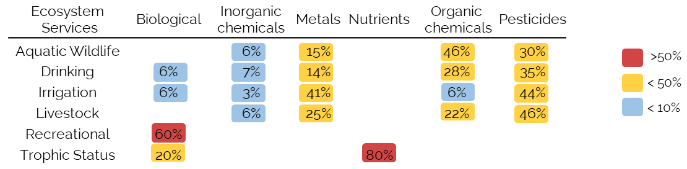

Exploring water quality
================
Nicolas F. S-Gelais
2018-07-27

Abstract
========

-   WQ perspective in the different fields
-   How water quality is tested and how it this evaluation compare with real data.

How would you define water quality? Even if it’s a concept that is often used to characterize the suitability body of water to provide a given ecosystem service, defining this concept is not a simple task. One of the mains challenges of defining water quality is that the notion of it is highly context dependent. For example, an ecologist may view water quality as a function of trophic status, whereas from a public health perspective, water quality is defined as a characteristic of a water that is safe for human consumption or recreation. As a consequence, the parameterization of water quality is often limited to very specific criteria for different aquatic ecosystem services (ES). Water quality is rarely assessed as an integrative measure that considers the tradeoffs between multiple uses.

Introduction
============

Water is a ressource that under a great pressure at a global level, in 2010 it was evaluated that "80% of the world’s population is exposed to high levels of threat to water security" (Vörösmarty et al. 2010). In Canada... (WWF 2017)

**The importantce of the term water quality in scientific reaearch is increasing**

According to [dimensions.ai](https://www.dimensions.ai/)), the proportion of published papers in ecology ( with the term water quality has more than doubled (from 6.6% to 14% of papers) since 1980, and the occurence within in the abstract or title of ecological papers has more than tripled over the same period (0.7% to 2.3%). The increase use of the term water quality in ecology, is similar to what was observed in other fields (see Figure 1b). This suggest that water quality is a subject that is increasing in importance in science in general. In ecology, an increase that is consistant but a little bit smaller than what is observed in the literature in general (from 0.05% to 0.15%). But how the term water quality use in the different fields?

**The definition of wq**

How would you define water quality? According to the world health organization (WHO) water quality is a a “ term used here to express the suitability of water to sustain various uses or processes." (REF). From this definition it is clear that water quality is a complex concept that involve many different components.

*Figure 1: (a) comparing three different world views of water quality and (b) The temporal evolution (1980-2017) of the proportion of paper with the term water quality in different fields and in the literature in general based on [dimensions.ai](https://www.dimensions.ai/)*

**How wq is used in different fields + patterns in each field**

In ecology, changes in water quality are often equated to the eutrophication of aquatic ecosystems, (see, V. H. Smith 2003; Howarth and Marino 2006) when water quality was present in abstract or title of an ecological papers, 48% of the time a term related to eutrophication was also found in the abstract (i.e. eutrophication, nutrient, phosphorus, nitrogen). While in the public health domain the term water quality was 57% of the time found along term related to drinking water (keyword: drinking), compared to ecology this proportion is only 4%. While in the soil science field 18% of the abstract with water quality also mentionned irrigation compared to 2% in ecology.

This example shows that

**Time for a comprehensive approach + ecosystem service approach enable... **

Approach and framework
======================

The main objective with the framework we are developping here is to enable an evaluation of how often ES \[...\]

**Aggregated guideline database**

We created an aggregated guidelines database (*link to the Db*) composed of Canadian guidelines that are used to determine if water can safely provide the following selected uses: drinking water, recreation (i.e. swimming), irrigation, livestock water and for the protection of aquatic wildlife (CCME REF). *Few guidelines were under the detection limit for a compounds, in those situations we used detection limit multiplied by 2 as a guideline to \[...\]*. For trophic status, we used (**???**) river trophic status classification. In summary, the canadian guidelines for the five selected uses are based on 176 different chemical compounds. We then grouped the guidelines by chemical groups (based on the CCME classification) to assess the amount of overlap between the guidelines used for each ecosystem service. To do so, for each ES, we calculated the proportion of guidelines used in each chemical group (See Table 1). Following this step, for each chemical group we selected compounds that we used as guidelines for the highest number of ES for further analyses (see categories table).

*Table 1: The proportion of guidelines in each chemical group by ecosystem services (ES) based on Canadian guidelines (CCME 2018; Dodds and Smith 2016).*

**Creating an aggregated limnological database**

We developped a R function (*dbExtract*) to search openly available canadian limnological databases for measures of the previously selected compounds (see Table X) in rivers. The search within databases 46 databases resulted in 660 000 unique observations in river across Canada (See Figure 1) between over 22 years 1995-2017. Observation, were then grouped by station and by month (*dbSpread* function) to create a aggregated limnological database of 5218 observations.

Figure 1 : Map of sampling locations across canada

We also developped the *ESeval* function to evaluate, for each sampling event (by month and by station) in the aggregated limnological DB, the potential of providing each ES based on the aggregated guideline db (See Figure S1). Because there was an important variability in the variables measured at each sampling event, the potential of providing a given ES was based on the guidelines for which a measure was available. When for a samplign event no measures enable to evaluate whether a service could be provided, the service wasn't evaluated for this specific event. To compare the overlap in guidelines (Figure 1) to the emperical overlap between uses in river, we developped the *overlapES()* function to calculate how often when one fiven services can be provided, other services can be provided as well.

*Identify which guidelines is limiting use across sites*

Finaly for, for each selected guidelines, we calcuated how often it was limiting a specific use. We developed the *limFreq()* function, which simply calculates how often a a specfic compound was over the guideline, hence preventing a ES form behing provided, when measured. The results from this analysis are reported in table S1, and for each chemical groups we report the highest limiting frequency in table X. This metric enable to (i) compare the how often a guideline is used versus how often it is empirically limiting and (ii) identify compounds that are often limiting but rarely measured which could mean that we overestimated of often a given use can be provided by a system.

### Results and discussion

*Guidelines overlap*

We observed an important overlap (Table 1) between the guidelines used for Aquatic wildlife protection, Drinking, Irrigation and Livestock, all established by the Canadian Council of Ministers of the Environment (CCME). This overlap can probably be explained the CCME guidelines are largely eco-toxicological guideline in which the toxological impact of these compunds on living organisms is establish experimentally (citation CCME). As a consequence, the CCME guidelines are mainly based on the concentration of metals, pesticides and other organics compounds that are toxic for living organims.

In opposition, the guidelines for recreation (i.e. case swimming), which are establish by Health Canada (**???**), are mainly based on biological indicators (fecal contamination and microsystin) and on pH and water temperature (not shown in Table 1). It is interesting to note that this difference in guidelines can also be observed emperically as sampling event for which swimming was possible the suitability for aquatic wildlife, drinking and irrigation was lower than it was in average across the country (respectivly 37%, 34%, 66%, see table S1 ), which suggest an uncoupling between these uses. The observed uncoupling between recreation and drinking and irrigation is be explained by E.Coli beind rarely measured but often limiting for these two uses, while recreation can only be evaluated when E.Coli was measured. However, as there is no overlap between the

It is intereting that guidelines for swimming are so different than guidelines for drinking water as they are both related to human health, but this can be explained by swimming (?). Finally, the trophic status classification of river that we used (Dodds 19XX) is based on nutrients concentration and chla, which is interesting as the effect of these compounds have an indirect effect on ecosystem, but are not generaly concidered as contamiant they have ecosystemic consequences.

*Compare ecoservices in the dataset*

In this table, we compare the occurence of the different ecoservices in the dataset. On the diagonal of this table, the proportion of sites for which a given criteria was met is reported. Outside the diagonal we are reporting how often the column criteria is met when the row criteria is met.

In this dataset, 32 % of sites were oligotrophic, 39 % mesotrophic and 18% eutrophic. Only 35% of the samples were suitable for aquatic life, 79% for swimming and 27% for drinking. For gricultural use, in 52% of the samples the water was usable for irrigation and 100% for livestock.

When the water is oligotrophic are more often suitable for aquatic life (36%), recreation (93%), drinking (42%) and irrigation (71%) than mesotrpohic and eutrophic samples.

First, no matter the trophic status of a river,in the data at hand, water was safe livestock more than 71% of the time (See table S1).Similarly, In a large proportion of rivers, even when the water was eutrophic, the water could be used as drinking water (89%-94%) or irrigation water (90%-98%), while for recreation water is usually safe in oligotrophic and mesotrophic rivers (respectivly 93% and 82%) and this proportion drops drastically in eutrophic rivers (44%). However, even oligotrophic rivers could be considered safe for aqautic life only 55% of the time, while for mesotrophic and eutrophic rivers it was respectivly 43% and 34%.

Even if, as we expected, for each use the % of suitable systems dropped with trophic status, the observed magnitudes were quite unexpected. First for drinking water, irrigation and recreation, as one would expect the propotion of suitable sample was high in oigotrophic rivers, but wasen't much lower for eutrophic system, in the sense that in the vast majority of rivers most services were still maintained. On limitation that is important to concider, it that we only used a subset of guidelines and that because of inconsistencies in data it wasen't possible to evaluate each guideline as a consequence it is possible that in reality the percentage of suitable samples was lower, but it is unlikly that our conclusions would be affected significantly.

On the other hand, for the protection of aquatic wildlife, even if we expected eutrophic systems to be less safe for aquatic wildlife, it is quite surprising that even in oligotrophic rivers, only 55% percent of the sample, water was concidered as safe of aquatic life. Here again the pattern make sense but the magnitude is off.

    ## $rect
    ## $rect$w
    ## [1] 0.9618752
    ## 
    ## $rect$h
    ## [1] 0.598154
    ## 
    ## $rect$left
    ## [1] 1
    ## 
    ## $rect$top
    ## [1] 1.2
    ## 
    ## 
    ## $text
    ## $text$x
    ## [1] 1.224308 1.224308 1.224308
    ## 
    ## $text$y
    ## [1] 1.0504615 0.9009230 0.7513845

#### Ecoservices PCA

------------------------------------------------------------------------

In the ecoservices PCA, the first and second axes are mainly trophic axes, on which, all ecoservices are more associated with oligotrophic water. On the third axis, we see a strong association between recreational and irrgations services, and between aquatic wildlife and drinking, but a negative association between the two groups. By looking at the ecoservices guideline table, it make sense that aquatic wildlife and drinking are associated, as their respectives guidelines are similar, but it isn't the case for irrigation and recreation.

#### Comparing the limiting guidelines

------------------------------------------------------------------------

The compound that most often limited aquatic wildlife was cadmium concentration followed by lead and fluride, three compounds that were rarely limiting for other uses. For drinking, even if E.coli was measuredin only 9% on the samples, it limited drinking water 89% of the time, which could indicate that we probably overestimated the proportion of rivers in which water was potable. While arsenic and lead limited water use only in few samples.

Similarly for irrigation and recreation, when E.coli was measured it limited suitability in respectivly 48% and 21% of the time which also indicate a potential overestimation.

But for Irrigation Dicamba, a pesticide that was measured in less than 0.1% of samples, limited irrigation 100% of the time when measured, which indicate that we probably overestimate the sutability of cnadian water for irrigation (under detection limit need to be revised.

Interestingly, for the selected uses, dicamba was the only measured pesticide with a limitimg effect. For livestock, asenic was the only limiting contaminant, and was only limiting less 1% of the time.

For trophic status, when a sample change from one trophic status to the other, TN and TP are almost always both over the guideline (Even if TP was measure more often)

maybe we should calculate how often a variable is limiting when measured?

### Perspective

### SI

 

|              |  oligotrophic|  mesotrophic|  eutrophic|  aquatic|  drink|  irrigation|  livestock|  recreational|
|--------------|-------------:|------------:|----------:|--------:|------:|-----------:|----------:|-------------:|
| oligotrophic |          0.32|         0.00|       0.00|     0.36|   0.42|        0.71|          1|          0.93|
| mesotrophic  |          0.00|         0.39|       0.00|     0.34|   0.26|        0.52|          1|          0.82|
| eutrophic    |          0.00|         0.00|       0.18|     0.32|   0.08|        0.22|          1|          0.44|
| aquatic      |          0.35|         0.40|       0.17|     0.35|   0.31|        0.58|          1|          0.84|
| drink        |          0.50|         0.37|       0.05|     0.40|   0.27|        1.00|          1|          1.00|
| irrigation   |          0.44|         0.39|       0.07|     0.38|   0.52|        0.52|          1|          1.00|
| livestock    |          0.33|         0.39|       0.18|     0.35|   0.27|        0.52|          1|          0.79|
| recreational |          0.38|         0.41|       0.10|     0.37|   0.34|        0.66|          1|          0.79|

### References

CCME. 2018. “Canadian Environmental Quality Guidelines.” <https://www.ccme.ca/en/resources/canadian_environmental_quality_guidelines/>.

Dodds, Walter, and Val Smith. 2016. “Nitrogen, Phosphorus, and Eutrophication in Streams.” *Inland Waters* 6 (2): 155–64. doi:[10.5268/IW-6.2.909](https://doi.org/10.5268/IW-6.2.909).

Howarth, Robert W., and Roxanne Marino. 2006. “Nitrogen as the Limiting Nutrient for Eutrophication in Coastal Marine Ecosystems: Evolving Views over Three Decades.” *Limnology and Oceanography* 51 (1, part2): 364–76. doi:[10.4319/lo.2006.51.1\_part\_2.0364](https://doi.org/10.4319/lo.2006.51.1_part_2.0364).

Smith, Val H. 2003. “Eutrophication of Freshwater and Coastal Marine Ecosystems a Global Problem.” *Environmental Science and Pollution Research* 10 (2): 126–39. doi:[10.1065/espr2002.12.142](https://doi.org/10.1065/espr2002.12.142).

Vörösmarty, C. J., P. B. McIntyre, M. O. Gessner, D. Dudgeon, A. Prusevich, P. Green, S. Glidden, et al. 2010. “Global Threats to Human Water Security and River Biodiversity.” *Nature* 467 (7315): 555–61. doi:[10.1038/nature09440](https://doi.org/10.1038/nature09440).

WWF. 2017. “A National Assessment of Canada’s Freshwater -Watershed Reports.” Toronto. <http://assets.wwf.ca/downloads/WWF_Watershed_Reports_Summit_FINAL_web.pdf>.
